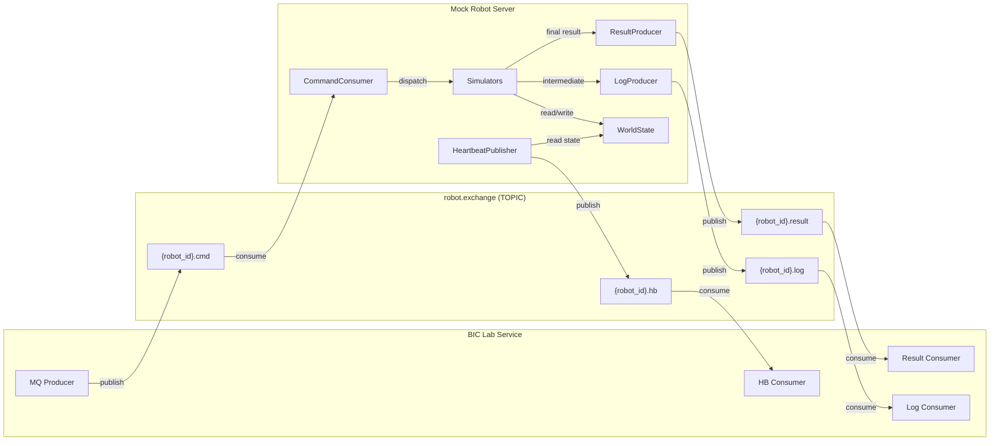
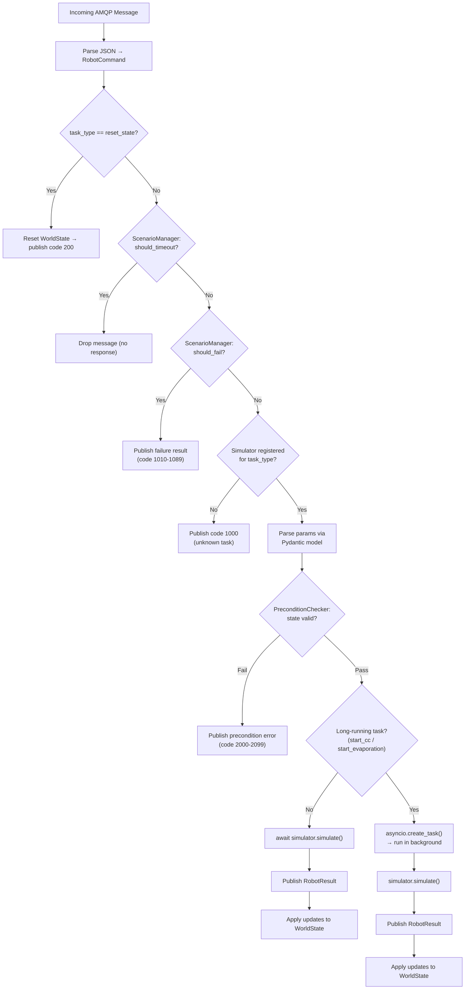
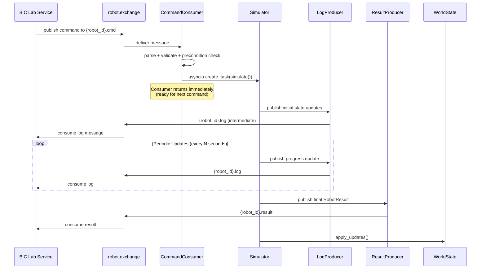
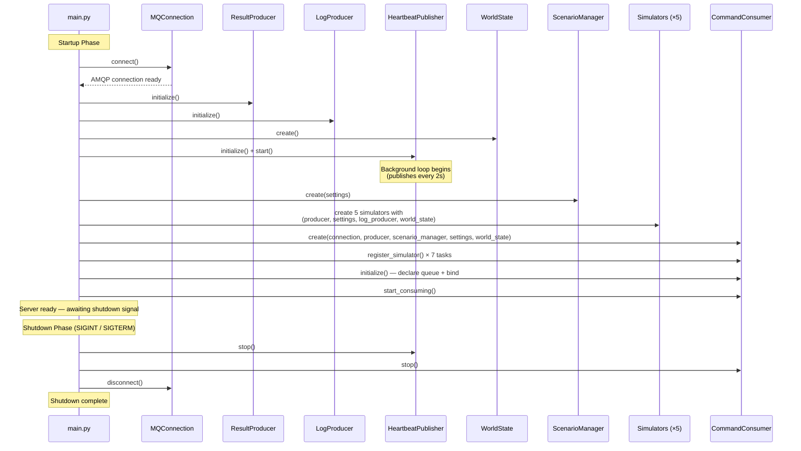

# Mock Robot Server

A standalone microservice that simulates the Robot Exchange MQ Server for local development and testing of the BIC Lab Service. Consumes robot command messages from RabbitMQ, simulates task execution with configurable timing and failure modes, and publishes realistic result messages with entity state updates.

## Architecture

All messages flow through a single **TOPIC exchange** (`robot.exchange`) with per-robot routing keys. The mock server consumes commands and publishes results, logs, and heartbeats — replicating the exact AMQP topology of the real robot's `mars_service`.



**Routing keys:**
- `{robot_id}.cmd` — Commands from BIC Lab Service → Robot
- `{robot_id}.result` — Final task results from Robot → BIC Lab Service
- `{robot_id}.log` — Real-time intermediate state updates during execution
- `{robot_id}.hb` — Periodic heartbeat messages (every 2 s)

**Dependencies:** RabbitMQ only. No PostgreSQL, Redis, or S3 required.

## Quick Start

### Docker (recommended)

```bash
# Build and run
docker build -t mock-robot-server .
docker run --rm \
  -e MOCK_MQ_HOST=rabbitmq \
  --network bic-lab-service_app-network \
  mock-robot-server
```

### Docker Compose (with BIC Lab Service)

Add to the BIC Lab Service project-level `docker-compose.override.yml`:

```yaml
services:
  mock-robot:
    build:
      context: ../mock-robot-server
      dockerfile: Dockerfile
    environment:
      MOCK_MQ_HOST: rabbitmq
      MOCK_BASE_DELAY_MULTIPLIER: "0.01"   # 100x speed for fast iteration
      MOCK_FAILURE_RATE: "0.1"             # 10% random failures
    depends_on:
      rabbitmq:
        condition: service_healthy
    networks:
      - app-network
    restart: unless-stopped
```

Then run everything together:

```bash
docker-compose -f docker-compose.yml -f docker-compose.override.yml up -d
```

### Local Development

```bash
# Install dependencies
uv sync

# Run directly
uv run python -m src.main
```

## Configuration Reference

All settings are loaded from environment variables with `MOCK_` prefix via pydantic-settings.

| Variable                        | Default                                | Description                                                             |
|---------------------------------|----------------------------------------|-------------------------------------------------------------------------|
| `MOCK_MQ_HOST`                  | `localhost`                            | RabbitMQ host                                                           |
| `MOCK_MQ_PORT`                  | `5672`                                 | RabbitMQ port                                                           |
| `MOCK_MQ_USER`                  | `guest`                                | RabbitMQ username                                                       |
| `MOCK_MQ_PASSWORD`              | `guest`                                | RabbitMQ password                                                       |
| `MOCK_MQ_VHOST`                 | `/`                                    | RabbitMQ virtual host                                                   |
| `MOCK_MQ_EXCHANGE`              | `robot.exchange`                       | Shared TOPIC exchange for all message routing                           |
| `MOCK_MQ_CONNECTION_TIMEOUT`    | `30`                                   | RabbitMQ connection timeout (seconds)                                   |
| `MOCK_MQ_HEARTBEAT`             | `60`                                   | AMQP heartbeat interval (seconds)                                       |
| `MOCK_MQ_PREFETCH_COUNT`        | `5`                                    | Consumer prefetch count                                                 |
| `MOCK_ROBOT_ID`                 | `talos.001`                            | Simulated robot identifier (string, used in MQ routing keys)            |
| `MOCK_DEFAULT_SCENARIO`         | `success`                              | Default scenario: `success`, `failure`, or `timeout`                    |
| `MOCK_FAILURE_RATE`             | `0.0`                                  | Probability of injecting a failure (0.0 - 1.0)                          |
| `MOCK_TIMEOUT_RATE`             | `0.0`                                  | Probability of injecting a timeout / no response (0.0 - 1.0)            |
| `MOCK_BASE_DELAY_MULTIPLIER`    | `0.1`                                  | Speed multiplier for task durations (0.01 = 100x fast, 1.0 = realistic) |
| `MOCK_MIN_DELAY_SECONDS`        | `0.5`                                  | Minimum delay floor (seconds)                                           |
| `MOCK_IMAGE_BASE_URL`           | `http://minio:9000/bic-robot/captures` | Base URL returned in mock captured image URLs                           |
| `MOCK_SERVER_NAME`              | `mock-robot-server`                    | Server instance name for logging                                        |
| `MOCK_LOG_LEVEL`                | `INFO`                                 | Log level (`DEBUG`, `INFO`, `WARNING`, `ERROR`)                         |
| `MOCK_HEARTBEAT_INTERVAL`       | `2.0`                                  | Seconds between heartbeat messages                                      |
| `MOCK_CC_INTERMEDIATE_INTERVAL` | `300.0`                                | CC progress update interval at 1.0x (seconds)                           |
| `MOCK_RE_INTERMEDIATE_INTERVAL` | `300.0`                                | RE progress update interval at 1.0x (seconds)                           |

## Supported Task Types (7 Tasks — v0.3 Ground Truth)

| Task Name                                 | Realistic Duration    | At 0.1x Multiplier | Notes                                                 |
|-------------------------------------------|-----------------------|--------------------|-------------------------------------------------------|
| `setup_tubes_to_column_machine`           | 15 - 30 s             | 1.5 - 3 s          | Retrieves and mounts silica + sample cartridges       |
| `setup_tube_rack`                         | 10 - 20 s             | 1 - 2 s            | Retrieves and mounts tube rack at work station        |
| `take_photo`                              | 2 - 5 s per component | 0.2 - 0.5 s        | Navigates to station, captures device screen          |
| `start_column_chromatography`             | 30 - 60 min           | 3 - 6 min          | Long-running; intermediate updates via `.log` channel |
| `terminate_column_chromatography`         | 5 - 10 s              | 0.5 - 1 s          | Stops CC operation, captures result images            |
| `collect_column_chromatography_fractions` | ~1 min (tube count)   | ~6 s               | Collects fractions from tubes into flask              |
| `start_evaporation`                       | 30 - 90 min           | 3 - 9 min          | Long-running; sensor ramp via `.log` channel          |

## World State Tracking & Preconditions

The mock server maintains an in-memory `WorldState` that tracks all entities (robots, devices, materials) and validates preconditions before executing tasks. This enables realistic error simulation based on current system state.

**Error Code Ranges:**
- `1000-1009`: General errors (unknown task, validation failure)
- `1010-1089`: Task-specific failures (per-task 10-code ranges)
- `2000-2099`: Precondition violations (state-driven errors)

**Special Commands:**
- `reset_state`: Clears WorldState back to initial conditions (useful for testing)

**Precondition Examples:**
- `setup_cartridges` fails if ext_module already has cartridges (code 2001)
- `terminate_cc` fails if CC system not running (code 2030-2031)

## Scenarios

The mock server supports three execution scenarios, controlled globally by `MOCK_DEFAULT_SCENARIO` or injected randomly via `MOCK_FAILURE_RATE` / `MOCK_TIMEOUT_RATE`.

### Success

The default mode. The server simulates the full task lifecycle:
1. Acknowledges command receipt
2. Publishes intermediate entity state updates via `{robot_id}.log` during execution
3. Waits for the simulated duration
4. Publishes a final `RobotResult` via `{robot_id}.result` with `code: 200`, updated entity states, and any captured images

### Failure

Simulates a robot error mid-task:
1. Begins execution normally with intermediate updates
2. Aborts partway through
3. Publishes a `RobotResult` with task-specific error code (1010-1089), an error message, and partially updated entity states

### Timeout

Simulates a non-responsive robot:
1. Acknowledges the command
2. Never publishes a result message
3. Useful for testing the main service's timeout detection and recovery logic

**Injection priority:** Per-message random injection (`MOCK_FAILURE_RATE`, `MOCK_TIMEOUT_RATE`) takes precedence over `MOCK_DEFAULT_SCENARIO`. If both rates are `0.0`, the default scenario is used.

## Command Dispatch Pipeline

Every incoming message passes through a multi-stage pipeline before reaching a simulator:



## Long-Running Task Execution

The two long-running tasks (`start_column_chromatography`, `start_evaporation`) follow a distinct execution pattern. The consumer spawns them as background `asyncio.Task`s so it remains free to accept new commands immediately.



## Development

### Tech Stack

- **Python 3.12+**, async-first
- **aio-pika** — async RabbitMQ client
- **pydantic + pydantic-settings** — configuration and message schemas
- **loguru** — structured logging
- **uv** — package manager
- **ruff** — lint/format
- **pytest + pytest-asyncio** — testing

### Project Structure

```
mock-robot-server/
├── src/
│   ├── __main__.py                    # Entry point: python -m src.main
│   ├── main.py                        # Server lifecycle (startup/shutdown)
│   ├── config.py                      # pydantic-settings with MOCK_ prefix
│   ├── mq/                            # RabbitMQ communication layer
│   ├── schemas/                       # Protocol contract definitions
│   ├── simulators/                    # Per-skill task simulation logic
│   ├── generators/                    # Pure factory functions for outputs
│   ├── scenarios/                     # Failure and timeout injection
│   ├── state/                         # In-memory world state tracking
│   └── tests/                         # Unit and integration tests
├── docs/
│   ├── robot_messages_new.py          # v0.3 ground truth protocol definitions
│   └── case_study_request_collection.md  # Canonical request/response examples
├── Dockerfile
├── docker-compose.mock.yml
├── pyproject.toml
├── .env
└── CLAUDE.md
```

## Module Architecture

This section describes the design, responsibilities, and lifecycle of each major module. The overall server lifecycle is orchestrated by `main.py`:



### `mq/` — RabbitMQ Communication Layer

The message queue module handles all AMQP communication with RabbitMQ. It implements the robot-side of the protocol: consuming commands and publishing results, logs, and heartbeats through a single TOPIC exchange.

| File              | Class                | Design & Lifecycle                                                                                                                                                                                                                                                                                                                                                                                                                                                                                                                                                                                             |
|-------------------|----------------------|----------------------------------------------------------------------------------------------------------------------------------------------------------------------------------------------------------------------------------------------------------------------------------------------------------------------------------------------------------------------------------------------------------------------------------------------------------------------------------------------------------------------------------------------------------------------------------------------------------------|
| `connection.py`   | `MQConnection`       | Manages a robust AMQP connection with auto-reconnect. Provides lazy channel creation with QoS (prefetch count) and graceful disconnect. All MQ components share this singleton connection. **Lifecycle:** `connect()` during startup → shared by all producers/consumers → `disconnect()` on shutdown.                                                                                                                                                                                                                                                                                                         |
| `consumer.py`     | `CommandConsumer`    | The core dispatcher. Declares the `{robot_id}.cmd` queue, binds it to the TOPIC exchange, and processes incoming `RobotCommand` messages. For each message it: parses and validates parameters via Pydantic, checks preconditions against WorldState, applies scenario overrides (timeout/failure/success), and dispatches to the appropriate simulator. Long-running tasks (`start_cc`, `start_evaporation`) are launched as background `asyncio.Task`s so the consumer remains non-blocking. **Lifecycle:** `initialize()` declares queue → `start_consuming()` begins loop → `stop()` cancels consumer tag. |
| `producer.py`     | `ResultProducer`     | Publishes final `RobotResult` messages to `{robot_id}.result` with persistent delivery mode. Called once per task upon completion (or failure). **Lifecycle:** `initialize()` declares the exchange → called by consumer and long-running background tasks.                                                                                                                                                                                                                                                                                                                                                    |
| `log_producer.py` | `LogProducer`        | Publishes real-time `LogMessage` entries to `{robot_id}.log` during task execution. Simulators call this to stream intermediate entity state changes (e.g., cartridge `unused` → `inuse`) before the final result is ready. Uses persistent delivery. **Lifecycle:** `initialize()` declares exchange → injected into all simulators via constructor.                                                                                                                                                                                                                                                          |
| `heartbeat.py`    | `HeartbeatPublisher` | Runs a background asyncio loop that publishes `HeartbeatMessage` to `{robot_id}.hb` at a configurable interval (default 2 s). Reads the robot's current state from WorldState so the heartbeat accurately reflects operational status (e.g., `working` during CC). **Lifecycle:** `initialize()` + `start()` → background `asyncio.Task` runs indefinitely → `stop()` cancels the task gracefully.                                                                                                                                                                                                             |

### `schemas/` — Protocol Contract Definitions

Defines the Pydantic models and enums that constitute the wire protocol between LabRun and the robot. These types are a self-contained copy of the BIC Lab Service's canonical protocol definitions.

| File          | Contents                                                                                                                                                                                                                                        | Design Notes                                                                                                                                                                                                                    |
|---------------|-------------------------------------------------------------------------------------------------------------------------------------------------------------------------------------------------------------------------------------------------|---------------------------------------------------------------------------------------------------------------------------------------------------------------------------------------------------------------------------------|
| `protocol.py` | `TaskType` (7 tasks), `RobotState` (3 states: idle, working, charging), `EntityState` (5 states), `DeviceState`, `ConsumableState`, `ToolState`, `BinState`, `PeakGatheringMode`, plus all `*Params` models (one per task) and `CapturedImage`. | Single source of truth for the mock server. When the production protocol changes, update this file only. Uses `StrEnum` for JSON-friendly serialization. Aligned to `docs/robot_messages_new.py` ground truth.                  |
| `commands.py` | `RobotCommand` envelope model (`task_id`, `task_type`, `params`) and convenient re-exports of parameter models.                                                                                                                                 | Thin wrapper — params arrive as a raw `dict` and are validated later against the task-specific model in `consumer.py`.                                                                                                          |
| `results.py`  | `RobotResult`, `LogMessage`, `HeartbeatMessage`, 10 entity update models (`RobotUpdate`, `SilicaCartridgeUpdate`, `CCSystemUpdate`, `EvaporatorUpdate`, etc.) combined into a discriminated union `EntityUpdate` type.                          | Mock-friendly: property models use `str` for states (not strict enums) to tolerate compound states like `"used,pulled_out,ready_for_recovery"`. Discriminated union via the `type` literal field for type-safe deserialization. |

### `simulators/` — Per-Skill Task Simulation Logic

Each simulator encapsulates the behavior of one or more robot skills. All extend `BaseSimulator` (ABC) which provides shared infrastructure: `_apply_delay()`, `_publish_log()`, and `_resolve_entity_id()`.

| File                         | Class                    | Tasks Handled                                                                       | Design Notes                                                                                                                                                                                                                                                           |
|------------------------------|--------------------------|-------------------------------------------------------------------------------------|------------------------------------------------------------------------------------------------------------------------------------------------------------------------------------------------------------------------------------------------------------------------|
| `base.py`                    | `BaseSimulator` (ABC)    | —                                                                                   | Abstract `simulate()` method. Shared utilities: randomized delay with multiplier, log publishing via `LogProducer`, entity ID resolution from WorldState by location lookup. All simulators receive `(producer, settings, log_producer, world_state)` at construction. |
| `setup_simulator.py`         | `SetupSimulator`         | `setup_tubes_to_column_machine`, `setup_tube_rack`                                  | Simulates pick-and-place operations. Emits intermediate states: robot moving → materials mounted → robot idle.                                                                                                                                                         |
| `cc_simulator.py`            | `CCSimulator`            | `start_column_chromatography` (**long-running**), `terminate_column_chromatography` | `start_cc`: publishes initial update (CC `running`, materials `using`), then periodic progress updates at calculated intervals, then final result. `terminate_cc`: captures screen image, transitions materials to `used`. Resolves material IDs from WorldState.      |
| `photo_simulator.py`         | `PhotoSimulator`         | `take_photo`                                                                        | Delay scales by component count. Generates mock MinIO-style image URLs. Maps `device_type` strings to entity types for WorldState device-state updates.                                                                                                                |
| `consolidation_simulator.py` | `ConsolidationSimulator` | `collect_column_chromatography_fractions`                                           | Delay = (tubes × 3 s) + 10 s base. Produces updates for tube rack, round-bottom flask, and PCC left/right chutes with positioning data.                                                                                                                                |
| `evaporation_simulator.py`   | `EvaporationSimulator`   | `start_evaporation` (**long-running**)                                              | Publishes initial ambient sensor readings (25 °C, 1013 mbar), then linearly interpolates temperature and pressure toward targets across periodic updates, simulating a realistic sensor ramp.                                                                          |

### `generators/` — Pure Factory Functions

Stateless factory functions that build the data structures simulators need. Separated from simulators to keep simulation logic clean and factories independently testable.

| File                | Key Functions                                                                                                                                                                         | Design Notes                                                                                                                                                                 |
|---------------------|---------------------------------------------------------------------------------------------------------------------------------------------------------------------------------------|------------------------------------------------------------------------------------------------------------------------------------------------------------------------------|
| `entity_updates.py` | 10 factory functions: `create_robot_update()`, `create_silica_cartridge_update()`, `create_cc_system_update()`, `create_evaporator_update()`, etc. Also `generate_robot_timestamp()`. | Pure functions, no side effects. Each returns a typed Pydantic update model. Timestamp format: `YYYY-MM-DD_HH-MM-SS.mmm` (UTC).                                              |
| `timing.py`         | `calculate_delay()`, `calculate_cc_duration()`, `calculate_evaporation_duration()`, `calculate_intermediate_interval()`                                                               | All timing is `random.uniform(min, max) × multiplier` with a configurable floor. Long-running durations derived from experiment parameters (run_minutes, stop-trigger time). |
| `images.py`         | `generate_image_url()`, `generate_captured_images()`                                                                                                                                  | Builds MinIO-style paths: `{base_url}/{ws_id}/{device_id}/{component}/{timestamp}.jpg`. Returns `CapturedImage` objects with `create_time`.                                  |

### `scenarios/` — Failure and Timeout Injection

Controls whether a given task succeeds, fails with a realistic error, or silently times out. Enables chaos testing of LabRun's error-handling and retry logic.

| File          | Class / Function       | Design Notes                                                                                                                                                                                                   |
|---------------|------------------------|----------------------------------------------------------------------------------------------------------------------------------------------------------------------------------------------------------------|
| `manager.py`  | `ScenarioManager`      | Decides outcome per command. Priority: `timeout_rate` (random roll → no response) > `failure_rate` (random roll or `default_scenario=failure` → error result) > success. Stateless — each call is independent. |
| `failures.py` | `get_random_failure()` | Maps each `TaskType` to 3-4 realistic failure messages with task-specific error codes. Error code ranges: 1010-1019 for setup_cartridges, 1020-1029 for setup_tube_rack, etc. Returns `(code, message)` tuple. |

### `state/` — In-Memory World State Tracking

Maintains a consistent view of all entities (robot, devices, materials) so the mock server can validate preconditions and produce contextually accurate responses across a multi-step workflow.

| File               | Class                 | Design Notes                                                                                                                                                                                                                                                                                                                                                                                                                                |
|--------------------|-----------------------|---------------------------------------------------------------------------------------------------------------------------------------------------------------------------------------------------------------------------------------------------------------------------------------------------------------------------------------------------------------------------------------------------------------------------------------------|
| `world_state.py`   | `WorldState`          | Thread-safe in-memory store (RLock) keyed by `(entity_type, entity_id)`. `apply_updates()` merges entity updates from completed tasks. `get_entity()` and `get_entities_by_type()` enable lookups. `get_robot_state()` returns current robot state for heartbeat. `reset()` clears all state. Used by: simulators (entity ID resolution), heartbeat (current robot state), precondition checker (validation), consumer (state application). |
| `preconditions.py` | `PreconditionChecker` | Validates task-specific prerequisites against WorldState before execution. Uses `_find_entity_at_location()` to resolve entities by location (not by work_station_id). Returns structured `PreconditionResult(ok, error_code, error_msg)`. Lazy-initialized by `CommandConsumer` on first use.                                                                                                                                              |

### Protocol Schema Management

The protocol types (enums, command parameters, result types) are defined in `src/schemas/protocol.py`. This is a self-contained copy of the types from the BIC Lab Service's canonical protocol definitions.

**When the production protocol changes**, update `protocol.py` to match the new contract. The types that need to stay in sync:
- `TaskType`, `RobotState`, `EntityState`, `DeviceState`, `ConsumableState`, `ToolState`, `BinState` (enums)
- All `*Params` models (command parameters)
- `CapturedImage` (result metadata)

### Extending

**Add a new task type:**
1. Add the task name to `TaskType` enum in `schemas/protocol.py`
2. Define parameter model in `schemas/protocol.py`
3. Re-export from `schemas/commands.py`
4. Create a new simulator in `simulators/` (extend `BaseSimulator`)
5. Add entity update factory functions in `generators/entity_updates.py`
6. Add failure messages in `scenarios/failures.py`
7. Register the simulator in `main.py` and add param model mapping in `mq/consumer.py`

**Adjust timing:**
Modify base duration ranges in `generators/timing.py`. Each task has a `(min, max)` range; the `MOCK_BASE_DELAY_MULTIPLIER` scales all durations uniformly.

**Add new entity update types:**
1. Add the update model in `schemas/results.py` following the discriminated union pattern
2. Add it to the `EntityUpdate` union type
3. Add a factory function in `generators/entity_updates.py`

### Running Tests

```bash
uv run pytest src/tests/ -v
```

105 tests cover generators, scenarios, schemas, consumer integration, simulator integration, heartbeat, log producer, photo handling, preconditions, world state tracking, and full CC workflow.

## Case Study: Column Chromatography Workflow

This case study demonstrates a complete column chromatography workflow using the mock server, exercising all major task types and both quick and long-running simulation patterns.

### Scenario

An AI agent orchestrates a column chromatography experiment. The workflow consists of 7 sequential steps:

```text
setup_cartridges -> setup_tube_rack -> take_photo -> start_cc
    -> terminate_cc -> collect_fractions -> start_evaporation
```

### Step 1: Setup Cartridges

The agent publishes a command to mount silica and sample cartridges at the work station:

```json
{
  "task_id": "task-001",
  "task_type": "setup_tubes_to_column_machine",
  "params": {
    "silica_cartridge_type": "silica_40g",
    "sample_cartridge_location": "bic_09B_l3_002",
    "sample_cartridge_type": "sample_40g",
    "sample_cartridge_id": "sample_40g_001",
    "work_station": "ws_bic_09_fh_001"
  }
}
```

**Mock behavior:** 1.5-3 s delay (at 0.1x multiplier). Returns `code: 200`, `msg: "success"` with entity updates:
- Robot -> `working` at `ws_bic_09_fh_001`, description `"wait_for_screen_manipulation"`
- Silica cartridge -> `inuse` at `ws_bic_09_fh_001`
- Sample cartridge -> `inuse` at `ws_bic_09_fh_001`
- CCS ext module -> `using`

### Step 2: Setup Tube Rack

```json
{
  "task_id": "task-002",
  "task_type": "setup_tube_rack",
  "params": {
    "work_station": "ws_bic_09_fh_001"
  }
}
```

**Mock behavior:** 1-2 s delay. Returns tube rack -> `inuse`, description `"mounted"`, robot -> `working`.

### Step 3: Take Pre-Run Photo

```json
{
  "task_id": "task-003",
  "task_type": "take_photo",
  "params": {
    "work_station": "ws_bic_09_fh_001",
    "device_id": "cc-isco-300p_001",
    "device_type": "cc-isco-300p",
    "components": ["screen"]
  }
}
```

**Mock behavior:** 0.2-0.5 s delay (1 component). Returns `CapturedImage` entry with mock URL and robot -> `idle`.

### Step 4: Start Column Chromatography (Long-Running)

```json
{
  "task_id": "task-004",
  "task_type": "start_column_chromatography",
  "params": {
    "work_station": "ws_bic_09_fh_001",
    "device_id": "cc-isco-300p_001",
    "device_type": "cc-isco-300p",
    "experiment_params": {
      "silicone_cartridge": "silica_40g",
      "peak_gathering_mode": "peak",
      "air_purge_minutes": 1.2,
      "run_minutes": 30,
      "need_equilibration": true,
      "solvent_a": "pet_ether",
      "solvent_b": "ethyl_acetate",
      "left_rack": "16x150"
    }
  }
}
```

**Mock behavior (long-running pattern):**
1. Message is acknowledged immediately; simulation runs in a background asyncio task
2. **Initial intermediate update** (via `{robot_id}.log`): robot -> `working` with description `"watch_column_machine_screen"`, CC system -> `using` with experiment params and ISO timestamp, cartridges -> `inuse`, tube rack -> `inuse`
3. **Periodic progress updates** (via `{robot_id}.log`): CC system state published every N seconds
4. **Final result** (via `{robot_id}.result`, `code: 200`): robot -> `working` with description `"wait_for_screen_manipulation"`, CC system -> `using`

### Step 5: Terminate CC

```json
{
  "task_id": "task-005",
  "task_type": "terminate_column_chromatography",
  "params": {
    "work_station": "ws_bic_09_fh_001",
    "device_id": "cc-isco-300p_001",
    "device_type": "cc-isco-300p",
    "experiment_params": {
      "silicone_cartridge": "silica_40g",
      "peak_gathering_mode": "peak",
      "air_purge_minutes": 1.2,
      "run_minutes": 30,
      "need_equilibration": true
    }
  }
}
```

**Mock behavior:** 0.5-1 s delay. Returns CC system -> `idle`, cartridges -> `used`, tube rack -> `used`, plus a captured `screen` image.

### Step 6: Collect Fractions

```json
{
  "task_id": "task-006",
  "task_type": "collect_column_chromatography_fractions",
  "params": {
    "work_station": "ws_bic_09_fh_001",
    "device_id": "cc-isco-300p_001",
    "device_type": "cc-isco-300p",
    "collect_config": [1, 1, 0, 1, 1, 0, 0, 1]
  }
}
```

**Mock behavior:** Delay scales with tube count (5 collected × 3 s + 10 s base = 25 s × 0.1 ≈ 2.5 s). Returns:
- Robot -> `working` with description `"moving_with_round_bottom_flask"`
- Tube rack with positioning data
- Round bottom flask with container state
- Left/right PCC chutes with positioning data

### Step 7: Start Evaporation (Long-Running)

```json
{
  "task_id": "task-007",
  "task_type": "start_evaporation",
  "params": {
    "work_station": "ws_bic_09_fh_002",
    "device_id": "re-buchi-r180_001",
    "device_type": "re-buchi-r180",
    "profiles": {
      "start": {
        "lower_height": 150.0,
        "rpm": 120,
        "target_temperature": 45.0,
        "target_pressure": 200.0
      },
      "updates": [
        {
          "lower_height": 150.0,
          "rpm": 120,
          "target_temperature": 45.0,
          "target_pressure": 50.0,
          "trigger": { "type": "time_from_start", "time_in_sec": 3600 }
        }
      ]
    }
  }
}
```

**Mock behavior (long-running pattern):**
1. **Initial intermediate update** (via `{robot_id}.log`): robot -> `working` with description `"observe_evaporation"`, evaporator -> `using` with ambient values (`current_temperature=25.0°C`, `current_pressure=1013.0 mbar`)
2. **Periodic ramp updates** (via `{robot_id}.log`): evaporator readings linearly interpolate toward targets (temperature: 25 °C → 45 °C, pressure: 1013 → 200 mbar)
3. **Final result** (via `{robot_id}.result`, `code: 200`): evaporator -> `idle`, `current_temperature=45.0`, `current_pressure=200.0`, robot -> `idle`

### Testing Error Handling

Inject failures to test the main service's error recovery:

```bash
# 20% of tasks fail with realistic robot errors
MOCK_FAILURE_RATE=0.2 uv run python -m src.main

# All tasks timeout (no response published)
MOCK_DEFAULT_SCENARIO=timeout uv run python -m src.main

# Fast iteration: 100x speed + 10% failure rate
MOCK_BASE_DELAY_MULTIPLIER=0.01 MOCK_FAILURE_RATE=0.1 uv run python -m src.main
```

Example failure result for `setup_cartridges`:
```json
{
  "code": 1012,
  "msg": "Silica cartridge gripper malfunction: unable to secure cartridge",
  "task_id": "task-001",
  "updates": []
}
```

### Key Observations

1. **Quick vs. long-running**: Tasks like `setup_cartridges` (15-30 s) block the consumer until complete, while `start_cc` and `start_evaporation` run in background asyncio tasks — the consumer immediately acknowledges the message and can process other commands concurrently.

2. **Intermediate updates via log channel**: Long-running tasks publish entity state changes in real-time via `{robot_id}.log`, allowing the main service to update its database incrementally. Final results go via `{robot_id}.result`.

3. **Timing fidelity**: At `MOCK_BASE_DELAY_MULTIPLIER=0.01`, a 45-minute CC run completes in ~27 seconds. At `1.0`, it takes the full 45 minutes. This enables both fast CI testing and realistic integration testing.

4. **Scenario injection**: `MOCK_FAILURE_RATE` and `MOCK_TIMEOUT_RATE` apply per-message random injection, while `MOCK_DEFAULT_SCENARIO` sets a global default. This allows testing specific error paths or general resilience.

5. **WorldState preconditions**: The server validates entity states before execution, returning 2000-series error codes for precondition violations. This catches workflow errors (e.g., starting CC when already running) without needing the real BIC Lab Service validation.
